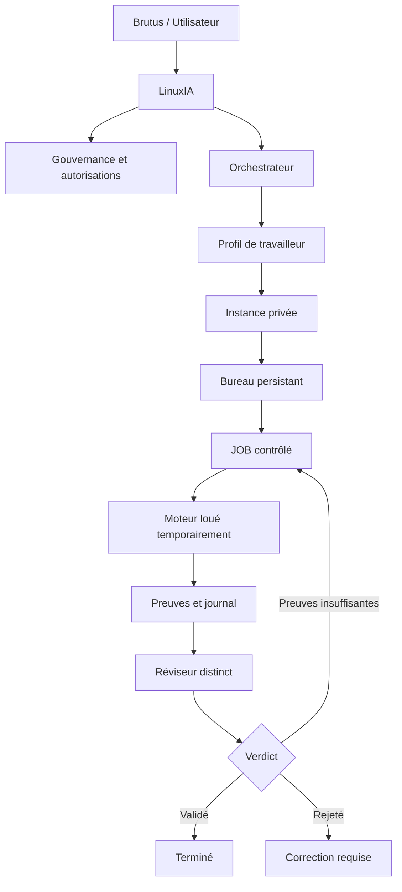

# ANTMUX / LinuxIA

> **Un environnement visuel et local-first pour organiser, exécuter, observer et valider le travail d’agents IA comme une colonie structurée.**

ANTMUX transforme la coordination de plusieurs agents, moteurs IA, terminaux, fichiers et projets en un système cohérent, inspectable et gouverné.

Le nom résume son rôle :

- **ANT** — les agents et travailleurs spécialisés;
- **MUX** — le multiplexeur qui distribue les tâches, les moteurs, les permissions et les flux de travail.

Le projet est créé et dirigé par **Gabriel St-Pierre — Brutus / Top Brutus**.

---

## Pourquoi ANTMUX existe

Les outils IA actuels fragmentent le travail entre plusieurs fenêtres de discussion, terminaux, modèles, dépôts, documents et mémoires isolées. L’utilisateur doit souvent coordonner manuellement les tâches, vérifier les résultats et reconstruire le contexte perdu.

ANTMUX vise à réunir ces éléments dans un même environnement où :

- chaque travailleur possède une identité et un rôle persistants;
- chaque bureau conserve son état, sa mémoire et ses preuves;
- les moteurs d’exécution restent interchangeables;
- les tâches suivent un cycle contrôlé;
- les actions sensibles exigent une autorisation explicite;
- les résultats sont révisés avant d’être déclarés terminés;
- l’activité réelle demeure visible et vérifiable.

L’objectif n’est pas de simuler une colonie décorative. Les fourmis, bureaux, moteurs et journaux doivent correspondre à de véritables objets logiciels, fichiers, permissions, événements et validations.

---

## LinuxIA

**LinuxIA** est l’intelligence résidente et l’interface centrale de l’écosystème ANTMUX.

Elle aide l’utilisateur à :

- formuler une intention;
- la transformer en tâche structurée;
- sélectionner un travailleur et un moteur compatibles;
- surveiller les dépendances et les risques;
- demander les autorisations nécessaires;
- suivre l’exécution;
- inspecter les preuves;
- soumettre le résultat à une révision distincte.

LinuxIA n’est pas censée devenir un agent tout-puissant. La gouvernance, l’orchestration, l’exécution et la révision restent séparées.

---

## Principe fondateur

```text
Le travailleur n’est pas le moteur.
Le bureau n’est pas le programme.
La mémoire n’est pas le cache.
La bibliothèque n’est pas une copie de chaque bureau.
L’orchestrateur n’est pas le gouverneur.
Une déclaration de succès n’est pas une preuve.
```

Cette séparation permet de remplacer un modèle ou un outil sans effacer l’identité, la mémoire ou l’historique du travailleur.

---

## Architecture cible



### Échelle visée

L’architecture directrice prévoit progressivement :

- **108 profils persistants** répartis dans 15 départements;
- **33 moteurs** locaux, distants ou hybrides dans un pool partagé;
- **32 composants logiques de communication**;
- **1 composant spécial de gouvernance**;
- des bureaux privés et persistants;
- une bibliothèque commune alimentée uniquement par des connaissances validées;
- une évolution local-first vers un usage multi-utilisateurs.

Ces nombres décrivent une **architecture cible**. Ils ne signifient pas que 108 travailleurs et 33 moteurs sont actuellement actifs.

---

## Premier building canonique

La construction doit commencer par un cycle minimal réel :

```text
1 tenant local
1 profil de travailleur actif
1 instance de travailleur
1 bureau persistant
1 moteur local déterministe
1 JOB actif à la fois
1 réviseur distinct
1 journal de preuves
```

Le premier building doit fonctionner de bout en bout, survivre à un redémarrage, rejeter les actions non autorisées et reconstruire son état depuis ses événements avant toute expansion majeure.

---

## Contrat de vérité

Toute capacité présentée dans les prototypes ANTMUX doit être classée honnêtement :

| Étiquette | Signification |
|---|---|
| `LOCAL_FUNCTIONAL` | La fonction exécute réellement ce qu’elle annonce localement. |
| `LOCAL_SIMULATION` | La logique fonctionne, mais simule un composant externe ou futur. |
| `VISUAL_DEMO` | Représentation visuelle sans exécution réelle. |
| `FUTURE_DISABLED` | Fonction future volontairement désactivée. |
| `UNVERIFIED` | Élément déclaré, mais non encore confirmé par une preuve. |

ANTMUX ne doit jamais présenter une animation, un message de succès ou une maquette comme une infrastructure réellement opérationnelle.

---

## Cycle d’un JOB

```text
Intention brute
→ intention structurée
→ JOB en brouillon
→ analyse des risques
→ permissions proposées
→ confirmation explicite de Brutus
→ exécution
→ production des preuves
→ révision contradictoire
→ replay et validation
→ terminé, rejeté ou preuves supplémentaires requises
```

Une tâche ne doit pas passer directement de brouillon à exécution. Une exécution ne doit pas être déclarée terminée sans preuves ni révision.

---

## Sécurité et gouvernance

Les règles structurantes sont :

- refus par défaut;
- autorisation humaine avant toute action sensible;
- permissions limitées au JOB courant;
- séparation entre gouvernance, orchestration, exécution et révision;
- journalisation des événements importants;
- checkpoints avant et après les actions;
- opérations importantes traçables, révisables et réversibles;
- aucune clé API ni secret dans les fichiers publics;
- aucune promotion automatique de mémoire privée vers une bibliothèque commune;
- aucune prétention de capacité sans preuve réelle.

---

## Local-first

La première fondation est conçue pour fonctionner sur un espace local dédié, notamment sous `D:\Antmux\`, avant d’introduire une plateforme distante.

Le local-first permet de stabiliser :

- les formats des bureaux;
- les identités de travailleurs;
- les permissions;
- les contrats des moteurs;
- la persistance;
- les journaux;
- les checkpoints;
- la reprise après interruption;
- la validation indépendante.

Le futur nom de domaine donnera accès à la plateforme; il ne sera jamais considéré comme l’emplacement logique unique des données.

---

## État actuel

| Composant | État |
|---|---|
| Documentation directrice | Disponible et en évolution |
| Prototypes visuels ANTMUX / LinuxIA | Disponibles |
| CLI et mécanismes locaux | Partiels, avec validation progressive |
| Premier building canonique | En construction |
| 108 profils persistants | Architecture documentée, non déployée intégralement |
| Pool de 33 moteurs | Architecture documentée, non opérationnelle intégralement |
| Multi-utilisateurs et bureaux distants | Conception future, non déployée |
| Domaine public et synchronisation distante | Futur, volontairement non activé |

Le dépôt contient à la fois du code expérimental, des prototypes et des documents d’architecture. Chaque élément doit être interprété selon son statut réel, pas selon son apparence.

---

## Documents principaux

Commencer par ces documents :

1. [Architecture de 108 profils et 33 moteurs](docs/communication/MODE-EMPLOI-ARCHITECTURE-108-PROFILS-33-MOTEURS.md)
2. [Architecture multi-utilisateurs, bureaux distants et moteurs locaux](docs/communication/MODE-EMPLOI-ARCHITECTURE-MULTI-UTILISATEURS-BUREAUX-DISTANTS.md)
3. [Prompt maître Meta — Cathédrale V02](docs/communication/PROMPT-MAITRE-META-ANTMUX-CATHEDRALE-V02.md)

Ces documents décrivent l’architecture complète. Le présent README sert de porte d’entrée et ne les remplace pas.

---

## Direction de construction

L’ordre rationnel est :

1. prouver un seul cycle local complet;
2. stabiliser un profil canonique, son bureau et sa mémoire;
3. louer un moteur déterministe local;
4. produire des preuves vérifiables;
5. ajouter un réviseur distinct;
6. valider le replay et la reprise après interruption;
7. généraliser progressivement vers d’autres travailleurs;
8. introduire la synchronisation distante seulement après validation locale.

La complexité visuelle ne doit jamais devancer la réalité technique.

---

## Vision

ANTMUX doit devenir un atelier où une personne peut diriger une équipe d’intelligences spécialisées sans perdre le contrôle, la mémoire, la provenance ni la compréhension du travail accompli.

La finalité est une plateforme capable de fabriquer d’autres projets avec une discipline supérieure à celle d’un simple ensemble de conversations IA :

> **comprendre → structurer → autoriser → exécuter → vérifier → mémoriser → améliorer**

---

## Création et gouvernance

- **Créateur et décideur final :** Gabriel St-Pierre — Brutus / Top Brutus
- **Intelligence résidente :** LinuxIA
- **Construction principale :** Rob
- **Dépôt officiel :** `Topbrutus/Antmux`

---

**Statut du projet : expérimental, local-first et en construction progressive.**
